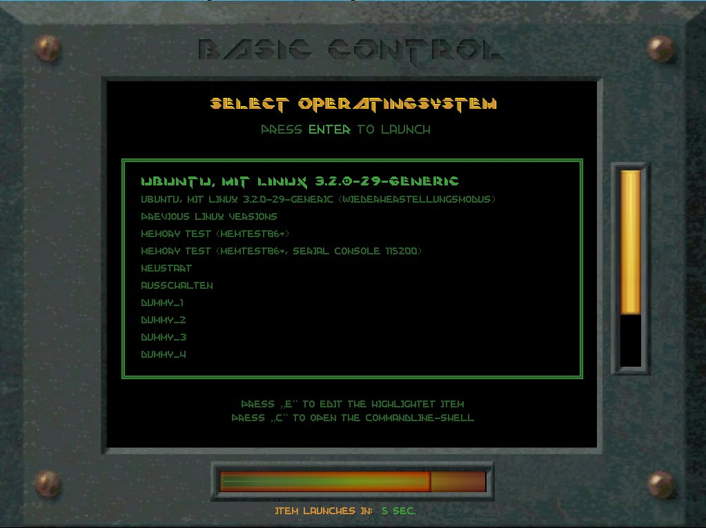

# Grub-Boot-Screen-Creator

This is just a simple script to install Grub Themes on Ubuntu 18.04. I have not tested it out anywhere else, but it works pretty good for me. 

The included them is a modify version of this:https://www.gnome-look.org/p/1000083/

And the script comes from this theme: https://www.opendesktop.org/s/Gnome/p/1220920/

I plan on perhaps continuing to develop this script to make it easier for people to modify and customize their grub screen. If you would like to contribute please let me know. 